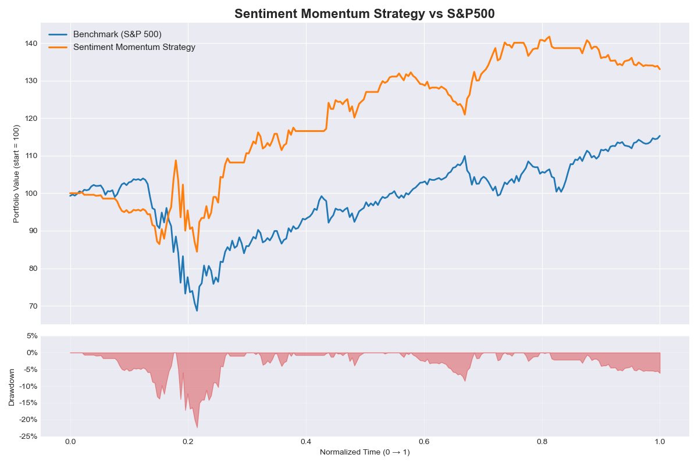

# Sentiment Analysis of StockTwits Comments with DistilBERT 

## Key Results
- **Annualized Return:** 14.8%
- **Annualized Sharpe Ratio:** 0.87
- **Maximum Drawdown:** –22.37%

## Example Outputs



## Project Structure
- config.py                 # Global configuration (paths, model names, parameters)
- data_utils.py             # Utilities for loading/merging tweet data and price data
- hf_dataset.py             # Builds HuggingFace Dataset objects for DistilBERT training
- models.py                 # Loads DistilBERT model and tokenizer
- train_distilbert.py       # Fine-tunes DistilBERT on StockTwits sentiment labels
- sentiment_signals.py      # Aggregates daily sentiment and generates trading signals
- backtest.py               # Computes returns, Sharpe ratio, and drawdown
- run_momentum_pipeline.py  # Full pipeline: prediction → sentiment → signals → backtest → plot
- loss_plot.py              # Visualizes training loss from loss.txt
- dataset.csv               # Merged dataset used for inference and daily sentiment construction
- ^GSPC.csv                 # S&P 500 price data used as benchmark
- tweet/
  - processed_stockemo.csv  # Cleaned full StockTwits dataset (after preprocessing)
  - train_stockemo.csv      # Chronological training split for DistilBERT
  - val_stockemo.csv        # Validation split for tuning/early stopping
  - test_stockemo.csv       # Held-out test set for final model evaluation

## Usage
1. Run DistilBERT training (this will automatically create `logs/` and `results/` directories)  
   ```
   python train_distilbert.py
   ```

2. Run full pipeline (prediction → signal → backtest → plot)  
   ```
   python run_momentum_pipeline.py
   ```
